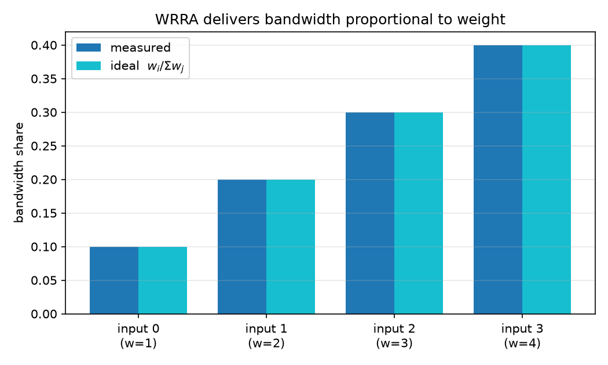
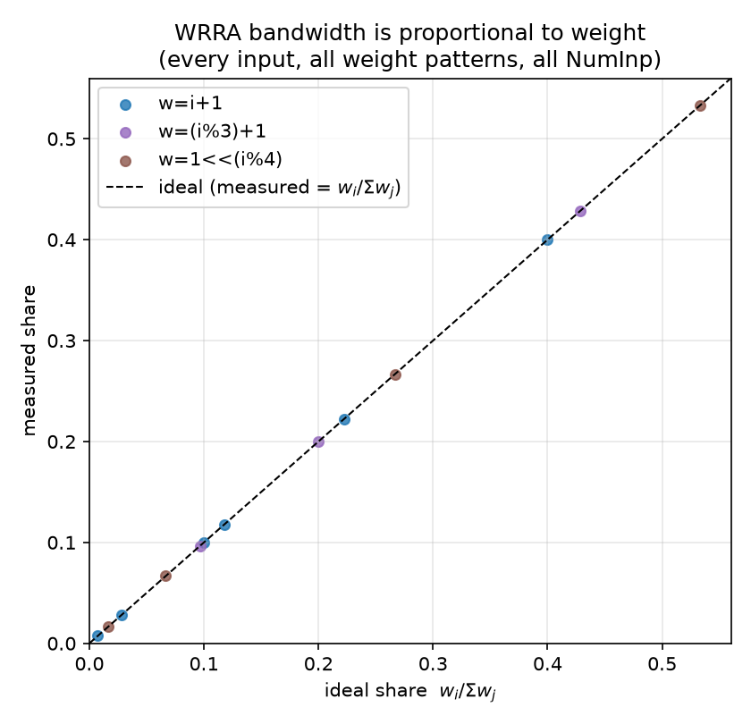
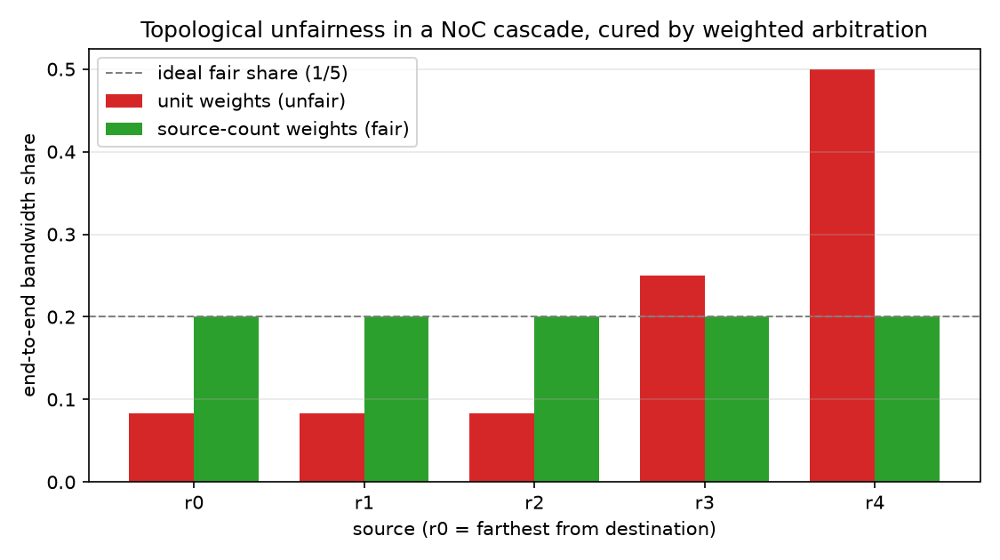
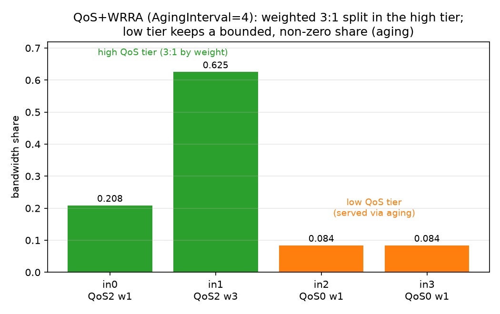
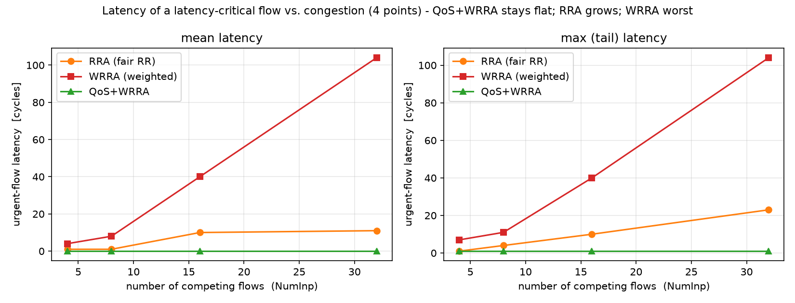
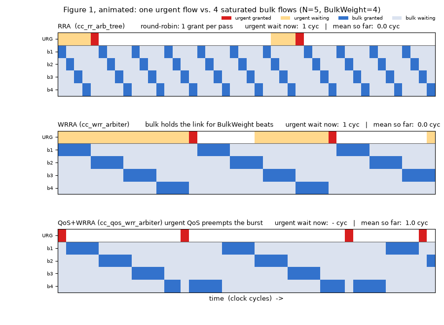
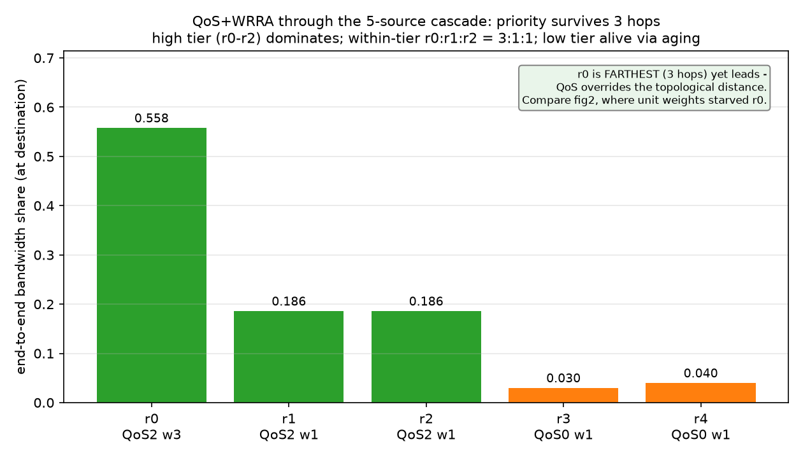
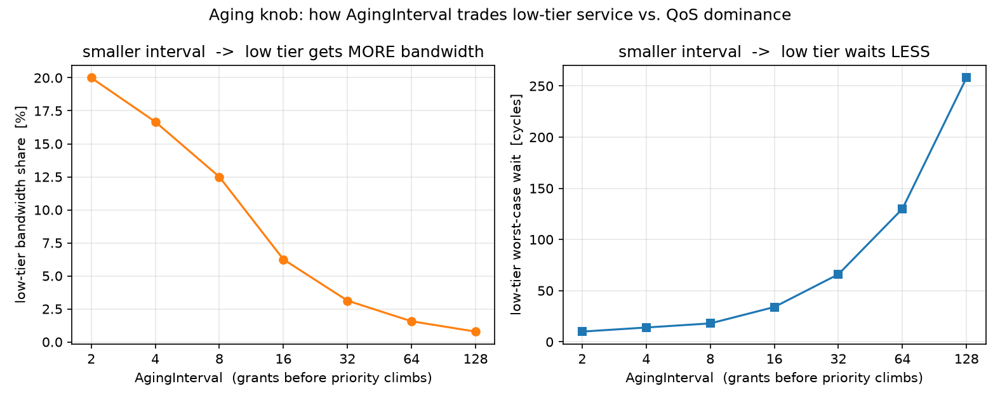
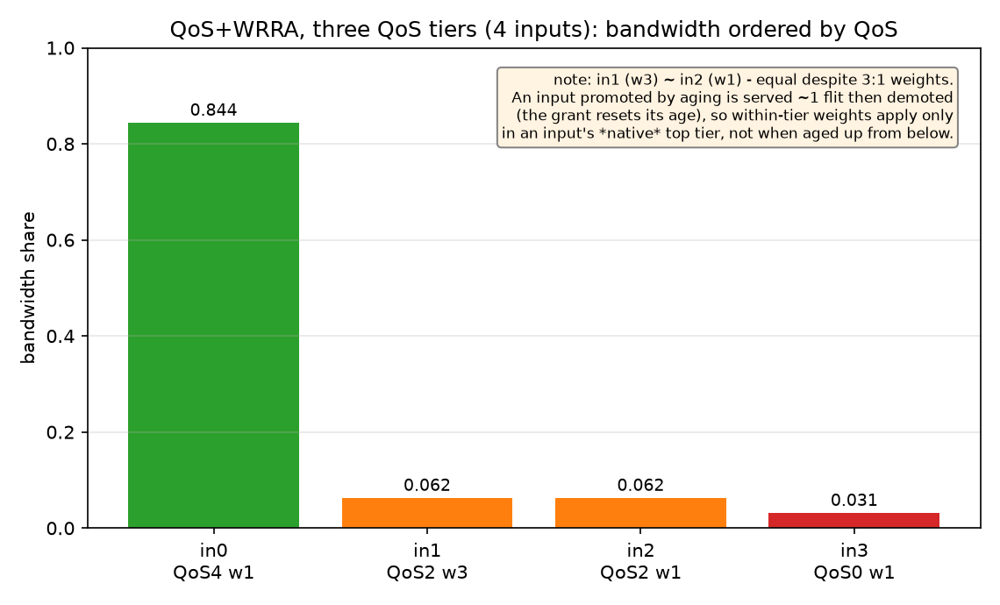
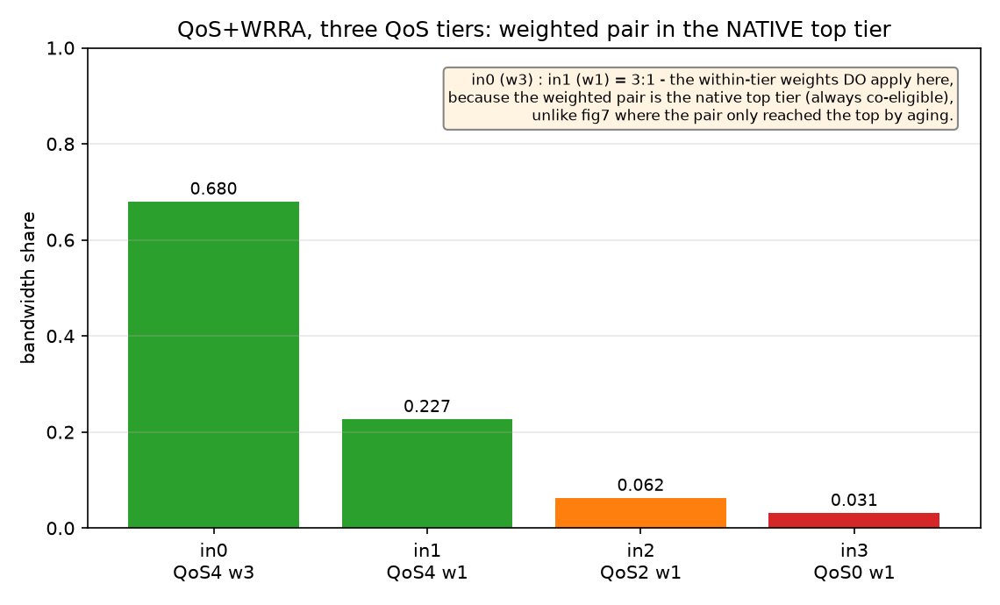

# Weighted Round-Robin Arbiter (`cc_wrr_arbiter`)

**SoC-DAML — Extending FlooNoC with Weighted Round-Robin Arbitration**
Student: Vatsal Dixit

---

## 1. Motivation: topological unfairness in a NoC

A plain round-robin (RR) arbiter is *locally* fair: when `n` inputs contend, each
receives `1/n` of the output bandwidth. In a NoC, however, traffic towards a common
destination is merged by a **chain/tree of arbiters**, and local fairness at each hop
does **not** give global fairness. Working back from the 1.0 bottleneck link of a
linear chain of fair 2-input arbiters (Dally & Towles, *Principles and Practices of
Interconnection Networks*):

| Arbiter | splits | local source | through (upstream) |
| ------- | ------ | ------------ | ------------------ |
| A2      | 1.0    | r3 = 0.50    | 0.50               |
| A1      | 0.50   | r2 = 0.25    | 0.25               |
| A0      | 0.25   | r1 = 0.125   | r0 = 0.125         |

The source farthest from the destination (`r0`) is starved at `1/8` while the nearest
(`r3`) takes `1/2`. This is **topological unfairness**: it is a property of *where* a
requester sits, not of the arbiter being unfair.

**Fix.** Replace each RR arbiter with a *weighted* RR arbiter and weight every input by
the number of original requesters whose traffic it aggregates. Because each "through"
input is the funnel for all upstream sources, its weight must reflect that. Weights are
**additive up the tree** (an arbiter input's weight = sum of the leaf weights it carries),
so every leaf source ends up with an equal — or, more generally, an `ωᵢ`-proportional —
share at the bottleneck, regardless of hop depth or router radix.

---

## 2. The cell

`cc_wrr_arbiter` is a generic, `NumIn`-input, valid/ready arbiter that merges its inputs
onto one output while distributing bandwidth proportionally to a per-input weight:

```
bandwidth_i = w_i / Σ_j w_j      (j over the currently-contending inputs)
```

### Interface (summary)

| Port        | Dir | Description                                            |
| ----------- | --- | ----------------------------------------------------- |
| `req_i`     | in  | per-input valid                                       |
| `gnt_o`     | out | per-input ready (one-hot)                             |
| `data_i`    | in  | per-input payload (`data_t`, generic)                 |
| `weights_i` | in  | per-input weight (`WtWidth` bits each)                |
| `req_o`     | out | output valid                                          |
| `gnt_i`     | in  | output ready                                          |
| `data_o`    | out | winning input's payload                               |
| `idx_o`     | out | winning input index                                   |
| `flush_i`   | in  | synchronous clear of arbiter state                    |

### Mechanism: deficit / burst weighted round robin

The weight is realised as a **burst**. When an input wins, it is granted up to `wᵢ`
consecutive flits (one flit = one accepted valid/ready transfer) before the round-robin
pointer advances to the next contender. Over one full rotation that visits every contender
once, input `i` emits `wᵢ` of `Σⱼ wⱼ` flits — giving the bandwidth split above.

(Note: a *burst* here is a bandwidth allowance — `wᵢ` consecutive flits from one input — and
is deliberately **not** a NoC *packet*. The flits in a burst are independent and may span
several logical packets; "packet" is reserved for the atomic wormhole-routed unit.)

The cell is a thin wrapper around the existing `cc_rr_arb_tree`:

* The inner `cc_rr_arb_tree` (with `FairArb` + `LockIn`) is used **only as a winner
  picker** — it produces the winning index and holds it stable. Its `gnt_i` is pulsed
  exactly **once per burst** (on the last accepted flit), so its round-robin pointer
  advances once per burst rather than once per flit.
* The data path and the per-input ready are muxed externally from the winning index.
* A burst counter (`cnt`) tracks the flits remaining in the current burst.

---

## 3. Design decisions and trade-offs

These are also documented inline in `src/cc_wrr_arbiter.sv`.

1. **Burst weighting (deficit RR), not interleaving.** A burst arbiter is small and
   simple. The cost is *burstiness*: a low-weight input waits through a full high-weight
   burst, so its latency/jitter is worse than a WFQ-style interleaved scheme would give.
   The steady-state **bandwidth** ratio is identical either way, so for bandwidth shaping
   under contention the burst scheme is the right trade.

2. **Reuse `cc_rr_arb_tree` for selection.** Rather than re-implement fair rotation, the
   cell layers the burst counter on the proven tree. This keeps the new logic minimal
   and inherits the tree's fairness and timing properties.

3. **Contender snapshot (`req_lock_q`).** The inner arbiter's `LockIn` carries a formal
   assumption that *unserved requests are not deasserted while it is locked*. The wrapper
   therefore feeds the inner arbiter a **frozen snapshot** of the contender set, captured
   at the start of each burst and held until the burst completes. This keeps the inner
   arbiter within its usage contract even if a non-winning input bubbles mid-burst (which
   is harmless to the served traffic, but would otherwise trip the inner assertion). The
   snapshot is only refreshed on burst-boundary cycles, where the inner lock is
   disengaged and refreshing is legal.

4. **`cnt_eff` makes the weight live on the first flit.** A plain counter register lags by
   one cycle, so on the first flit of a burst it would still hold the previous value. The
   cell uses `cnt_eff = load_round ? sel_weight : cnt_q`, which presents the freshly
   selected weight on the very first flit. Without this, the first winner after every idle
   period would be truncated to a single grant (this was a bug in the original
   `floo_wrr_arbiter` prototype this cell is derived from).

5. **Non-work-conserving within a burst (intentional).** A burst only advances on accepted
   flits. If the locked winner bubbles, the output waits for it rather than serving another
   ready input. This keeps the bandwidth ratio exact in the **saturated** regime the WRRA
   targets (the regime in which the topological-unfairness analysis is defined). Under
   non-saturation the ratio degrades gracefully towards the offered load.

6. **Weight `0` means "no service".** A weight-0 input is excluded from arbitration entirely —
   skipped and never granted, even while requesting (it gets zero bandwidth, as the weight says).
   This is implemented by masking it out of the contention set (`eff_req = req_i & (weight != 0)`),
   which also keeps the burst counter from ever loading `0`. If *every* requester has weight 0 the
   output simply stays idle.

---

## 4. Evaluation

Two testbenches verify the cell; both pass with `Errors: 0` in QuestaSim. Run via:

```
make vsim-elab
cd build/vsim
bash ../../test/simulate-wrra.sh
```

### 4.1 Unit check — `cc_wrr_arbiter_tb`

A single flat 4-input arbiter, all inputs saturated, weights `wᵢ = i+1` (sum 10). The
measured bandwidth share matches the `wᵢ/Σwⱼ` ideal exactly:

| Input | Weight | Measured | Ideal |
| ----- | ------ | -------- | ----- |
| 0     | 1      | 0.100    | 0.100 |
| 1     | 2      | 0.200    | 0.200 |
| 2     | 3      | 0.300    | 0.300 |
| 3     | 4      | 0.400    | 0.400 |

This confirms that **a higher weight `ωᵢ` directly buys proportionally more bandwidth** —
the property the assignment asks to demonstrate. A data-integrity check (`data_o ===
data_i[idx_o]`) also passes, confirming the output always carries the winning input's data.



Sweeping several weight patterns across several input counts, **every** input's measured share
lands on the `wᵢ/Σwⱼ` line:



### 4.2 Topological-unfairness cascade — `cc_wrr_arbiter_cascade_tb`

Five saturated sources `r0..r4` are merged towards one destination through a
**mixed-radix** cascade — a 3-input first hop plus two 2-input hops — to show the cell
works at arbitrary radix:

```
 r0 r1 r2 ─►[A0 (3-in)]─┐
                        ├─►[A1 (2-in)]─┐
                   r3 ──┘              ├─►[A2 (2-in)]─► Dest
                                  r4 ──┘
```

Each flit carries its source id as payload, so counting payloads at the destination gives
each source's end-to-end share. Two configurations are run:

**`Weighted = 0` (unit weights → plain RR at each hop): topological unfairness reproduced**

| Source | Measured | Ideal (1/12, 1/4, 1/2) |
| ------ | -------- | ---------------------- |
| r0     | 0.0833   | 0.0833                 |
| r1     | 0.0833   | 0.0833                 |
| r2     | 0.0833   | 0.0833                 |
| r3     | 0.2500   | 0.2500                 |
| r4     | 0.5000   | 0.5000                 |

**`Weighted = 1` (through-weights = aggregated source count, A1=3, A2=4): fairness restored**

| Source | Measured | Ideal (1/5) |
| ------ | -------- | ----------- |
| r0     | 0.2000   | 0.2000      |
| r1     | 0.2000   | 0.2000      |
| r2     | 0.2000   | 0.2000      |
| r3     | 0.2000   | 0.2000      |
| r4     | 0.2000   | 0.2000      |

The before/after pair demonstrates the full result: the WRRA, with weights assigned by the
additive-up-the-tree rule, **cancels the topological bias and equalises end-to-end
bandwidth** across sources at any radius and any router radix. The same weights can instead
be set unequal to *deliberately* favour selected requesters in proportion to their `ωᵢ`.



---

## 5. Extension: QoS priority + weighted RR (`cc_qos_wrr_arbiter`)

The WRRA controls **bandwidth** (how much of the link each input gets). It cannot control
**latency** — which request should be served *first*. These are two orthogonal axes:

| knob | controls | answers |
| ---- | -------- | ------- |
| `weights_i` (WRRA) | bandwidth (rate) | "how *much* of the link does this input get?" |
| `qos_i` (QoS) | priority (latency) | "when several wait, who goes *first*?" |

`cc_qos_wrr_arbiter` combines both. A per-input `qos_i` (like AXI `AxQOS`) selects the
served **tier**; within that tier, bandwidth is split by `weights_i` via `cc_wrr_arbiter`:

```
effective_qos[i] = qos_i[i] + age[i]
max_eff          = max over contenders of effective_qos[i]
eligible[i]      = req_i[i] && (effective_qos[i] == max_eff)   // the winning QoS tier
winner           = weighted round robin (by weights_i) among `eligible`
```

* **Anti-starvation via aging.** Strict priority would starve low-QoS traffic forever. To
  prevent it, a waiting request's *effective* QoS **ages upward**: `age[i]` climbs by 1 every
  `AgingInterval` **grants** (forward-progress cycles, not clock cycles — so a stall does not
  inflate ages) while the input is requesting but stuck below the winning tier. So any
  requester is guaranteed service within a bounded number of grants.
* **Tier across, weights within.** Across tiers QoS dominates (high QoS preempts); within a
  tier weights split the bandwidth. Weight 0 excludes an input from arbitration entirely.

---

## 6. Evaluation of QoS + WRR

All testbenches pass with `Errors: 0`.

### 6.1 Stable two-tier check — `cc_qos_wrr_arbiter_tb`

Four saturated inputs: high tier {input 0 (QoS 2, w 1), input 1 (QoS 2, w 3)}, low tier
{input 2, 3 (QoS 0, w 1)}, `AgingInterval = 64`.

| Input | QoS | weight | share | maxWait |
| ----- | --- | ------ | ----- | ------- |
| 0 | 2 | 1 | 0.246 | 6 cyc |
| 1 | 2 | 3 | 0.738 | 4 cyc |
| 2 | 0 | 1 | 0.0078 | 130 cyc |
| 3 | 0 | 1 | 0.0078 | 130 cyc |

* **Within-tier weighting is exact**: `cnt[1]/cnt[0] = 3.0000` (the 3:1 weights).
* **QoS priority**: the high tier takes 98.4 % of the link.
* **No starvation**: the low tier still gets bounded service (`maxWait = 130 ≈ qos_gap ×
  AgingInterval`) — aging works.

The figure below shows the same arbiter at `AgingInterval = 4` (so the low tier is clearly
visible — at the nominal 64 it is only ~0.8 %): the high tier splits 3:1 by weight, and the
low tier keeps a bounded, non-zero share via aging.



### 6.2 RRA vs WRRA vs QoS+WRRA — `cc_arbiter_compare_tb` (headline result)

Identical traffic through all three arbiters: `N−1` saturated bulk flows (QoS 0, weight 4)
plus one sporadic *urgent* flow (QoS 8, weight 1), with jittered arrivals. Swept over the
number of competing flows. **Urgent-flow request→grant latency (cycles):**

| NumInp | RRA mean / max | WRRA mean / max | QoS+WRRA mean / max |
| ------ | -------------- | --------------- | ------------------- |
| 4  | 2.0 / 3   | 9.7 / 15    | **0.76 / 1** |
| 8  | 4.0 / 7   | 15.6 / 31   | **0.76 / 1** |
| 16 | 7.1 / 15  | 40.2 / 50   | **0.72 / 1** |
| 32 | 10.9 / 23 | 104.2 / 114 | **0.48 / 1** |

Reading the result:
* **QoS+WRRA latency is flat (< 1 cycle, max 1) regardless of congestion** — the urgent flow
  jumps the queue at every contention level (the sub-cycle mean is just the occasional 1-cycle
  re-arbitration when it arrives mid-burst).
* **RRA latency grows with N** — fair round robin makes the urgent flow wait its turn among
  `N` peers, so latency scales with the number of competitors.
* **WRRA is *worst*** — giving the urgent flow a low weight makes it wait behind every bulk
  *burst* (`≈ (N−1)·weight`), reaching 104 cycles at N=32. This is the key insight:
  **weights alone cannot deliver latency; trying to use them for it actively hurts.** Only
  the QoS axis decouples latency from bandwidth.
* At **low congestion (N = 4, 8) plain RR already matches QoS+WRRA** — there is nothing to
  fix when few flows compete. The benefit is a property of *congestion*, which is exactly why
  the N-sweep (not a single point) is the right way to show it.

The full swept curve (finer `N`, with jittered urgent arrivals so the periodic-stimulus
resonance of §6.4 does not jag the lines) — note the linear blow-up of WRRA to ~168 cycles
while QoS+WRRA hugs zero. `N = 5` is marked as the **anchor**: it is the same source count as
the cascade experiments (§4.2, §6.3), so the swept result cross-references them.



The animation below makes the *mechanism* behind this curve visible: one urgent flow (top row,
**URG**) competes with 7 saturated bulk flows (`b1..b7`), arbitrated three ways in lock-step.
Under **RRA** the bulk grants march one beat at a time (a diagonal) and the urgent flow waits
about half a rotation; under **WRRA** each bulk flow holds the link for `BulkWeight = 4` beats
(fat bursts), so the urgent flow's wait (amber) stretches much longer; under **QoS+WRRA** the
urgent flow's high QoS **preempts** the in-flight burst and is served almost immediately (red).
It is a faithful behavioural model of the three arbiters at `N = 8` (we have no cycle-accurate
trace here), with mean urgent waits of ≈ 4.7 / 21.2 / 1.0 cycles respectively — the same
ordering as the swept curve above.



### 6.3 QoS through the cascade — `cc_qos_wrr_cascade_tb`

The mixed-radix cascade from §4.2 rebuilt from `cc_qos_wrr_arbiter`, with **per-flit QoS**
(each flit carries its QoS in the header, read at every hop). The farthest source `r0`
injects sporadic flits; we measure their end-to-end latency:

| Config | r0 end-to-end latency (mean / max) |
| ------ | ---------------------------------- |
| `UrgentQos = 8` (prioritised) | **0.27 / 1 cyc** |
| `UrgentQos = 0` (uniform baseline) | 4.0 / 4 cyc |

QoS shortcuts the latency-critical flow through every hop — even though `r0` is the
topologically disadvantaged source — while weights keep bulk bandwidth fair.

#### 6.3.1 QoS *bandwidth share* through the cascade — `cc_qos_wrr_cascade_share_tb`

§6.3 measures *latency* through the cascade; this is the *bandwidth* counterpart, run on the
**same 5-source structure** so the QoS results are directly comparable to the topological study
of §4.2 (and to the flat two-tier test of §6.1, which isolates the same mechanism on a single
arbiter). All five sources are now **saturated**, with a **3-high / 2-low** QoS layout mapped
onto the cascade and a weighted pair in the high tier:

| Source | hops to dest | QoS | weight | tier |
| ------ | ------------ | --- | ------ | ---- |
| `r0`   | 3 (via A0)   | 2   | **3**  | high (weighted) |
| `r1`   | 3 (via A0)   | 2   | 1      | high |
| `r2`   | 3 (via A0)   | 2   | 1      | high |
| `r3`   | 2 (via A1)   | 0   | 1      | low  |
| `r4`   | 1 (via A2)   | 0   | 1      | low  |

Each source's share is counted **at the destination** (by the flit's source id), after 1–3 hops
of re-arbitration. Three things fall out:

* **QoS priority survives the cascade.** The high tier (`r0..r2`) dominates the destination
  bandwidth even though those sources are the *farthest* — the exact opposite of fig2, where
  unit weights starved `r0` to 1/12. QoS overrides the topological distance.
* **The weighted split is realised at the merge.** The `r0 : r1 = 3 : 1` weighting is applied
  where they actually compete (the A0 hop), so it shows up as a `3:1` split *within* the high
  tier at the destination.
* **Aging keeps the low tier alive.** `r3, r4` (QoS 0) never starve.



One honest nuance: with QoS tiers active, the **topological-fairness through-weights**
(A1.through = 3, A2.through = 4) become *secondary* — QoS, not the port weights, now decides
the bulk of the bandwidth split. They still shape how the small low-tier (aging) share is
divided between `r3` and `r4`, but the headline split is set by QoS. (The numbers in fig8 are
produced by the `cc_qos_wrr_cascade_share_tb` run on the sim machine; rerun `simulate-wrra.sh`
and regenerate to populate them.)

### 6.4 Observed limitation: intra-tier fairness under *periodic* preemption

In §6.2's throughput (not latency) the bulk flows — though identical — do **not** get equal
shares at some `N` (e.g. N=16: a few get ~0.17, the rest ~0.009; N=4/32 are ~uniform).

Cause: the sporadic urgent flow preempts on a fixed period and, each time it is served, the
round-robin pointer is rewound to roughly the same place. Only the ~`gap/weight` bulk inputs
the pointer reaches before the next preemption get served; aging only sprinkles a few grants
on the rest. Whether this *freezes* on the same victims (unfair) or *drifts* across them
(uniform) depends on whether the preemption period aliases with the rotation length — the
same effect as a strobe light appearing to freeze or slowly rotate a spinning wheel. It is
therefore an **artifact of perfectly periodic stimulus**; jittering the inter-arrival gap (as
real traffic does) breaks the resonance and evens the shares out. It does not affect the
latency result, the within-tier weighting (§6.1), or correctness (no starvation).

This is confirmed empirically: the comparison testbench has a `GapJitter` knob that randomises
the urgent think-time. With it enabled the latency curves (fig1) smooth out **and** the bulk
shares become uniform — the same fix in both places, because both symptoms share the one
cause (periodic preemption resonating with the rotation).

### 6.5 The aging knob — quantified tradeoff

`AgingInterval` is the single dial that trades **low-tier protection** against **QoS
dominance**. Sweeping it on the two-tier test gives a clean, designer-facing curve:



Each time `AgingInterval` **doubles**, the low tier's bandwidth share roughly **halves** and
its worst-case wait roughly **doubles** (e.g. share `0.20 → 0.008`, max-wait `10 → 258` cycles
across intervals `2 → 128`). The figure splits this into two simple panels: low-tier
**bandwidth share** falls as the interval grows (left), while its **worst-case wait** rises
(right). So the value is read off whichever panel encodes the requirement — a bandwidth floor
(left) or a latency bound (right) — rather than being a fixed optimum. A practical
default is `16–32`: the high tier keeps ~94–97 % while the low tier holds a few percent with a
bounded few-tens-of-cycles wait.

### 6.6 Three QoS tiers — when does within-tier weighting hold?

Extending to **three** QoS levels across 4 inputs surfaces a subtle but important rule. Two
scenarios were run (`cc_qos_wrr_3tier_tb`):

**Weighted pair in the *mid* tier** (`QoS {4,2,2,0}`, weights `{1,3,1,1}`): the QoS-2 pair
in1 (w3) and in2 (w1) get the **same** share — the 3:1 weighting is **lost**.



**Weighted pair in the *native top* tier** (`QoS {4,4,2,0}`, weights `{3,1,1,1}`): now the
QoS-4 pair in0 (w3) and in1 (w1) split exactly **3:1** (0.680 : 0.227).



The reason is the aging mechanism: an input promoted into a higher tier *by aging* is served
**one flit and then demoted** (the grant resets its age, dropping its effective QoS), so its
burst — and hence its weight — never takes effect. The conclusion: **within-tier weights apply
only in an input's *native* top tier** (where it is always co-eligible), not when it is aged up
from below. This is the concrete, measured form of the aging-vs-weighting tension — two
mechanisms (round-robin weighting and aging) both deciding "who is served next" and only
composing cleanly within a single, stable tier.

---

## 7. Engineering issues found and fixed

The cascade/comparison testbenches exercised regimes the unit tests did not, surfacing three
bugs — each fixed and re-verified:

1. **First-flit burst truncation** (in the original `floo_wrr_arbiter` prototype). The burst
   counter lagged a cycle, so the first winner after every idle period got only one grant.
   Fixed with `cnt_eff` making the weight live on the first flit (§3.4).
2. **Mid-burst deadlock under QoS masking.** When the QoS wrapper demoted the current burst
   winner out of `eligible` mid-burst, the inner arbiter stayed locked on a now-ineligible
   winner forever — starving the high-QoS flow. Fixed by abandoning the burst when the locked
   winner stops requesting (`winner_gone`); under saturation it never triggers, so weighted
   behaviour is unchanged.
3. **Spurious grant on a masked winner.** `gnt_o` was asserted from `gnt_i` alone, so a
   winner masked out mid-cycle received a grant for a flit that never left (a dropped flit in
   real use, skewed throughput counts here). Fixed by gating the grant on the actual transfer
   (`gnt_o[winner] = req_o & gnt_i`).

---

## 8. Files

| File                                       | Purpose                                        |
| ------------------------------------------ | ---------------------------------------------- |
| `src/cc_wrr_arbiter.sv`                    | weighted round-robin arbiter (bandwidth)       |
| `src/cc_qos_wrr_arbiter.sv`                | QoS priority + aging + weighted RR             |
| `test/cc_wrr_arbiter_tb.sv`                | flat `wᵢ/Σwⱼ` throughput + weight-0 unit test  |
| `test/cc_wrr_arbiter_cascade_tb.sv`        | mixed-radix topological-unfairness cascade     |
| `test/cc_qos_wrr_arbiter_tb.sv`            | two-tier QoS+WRR (weighting + anti-starvation + aging sweep) |
| `test/cc_qos_wrr_3tier_tb.sv`              | three-QoS-tier scenarios (fig7 / fig7b)        |
| `test/cc_qos_wrr_cascade_tb.sv`            | per-flit-QoS cascade end-to-end latency        |
| `test/cc_qos_wrr_cascade_share_tb.sv`      | QoS bandwidth share through the 5-source cascade |
| `test/cc_arbiter_compare_tb.sv`            | RRA vs WRRA vs QoS+WRRA latency/throughput sweep |
| `test/simulate-wrra.sh`                    | runs the simulations + sweeps, writes `results.csv` |
| `test/waves/*.wave.do`                     | GUI waveform setups                            |
| `doc/plots/plot_arbiters.py`               | turns `results.csv` into the report figures    |
| `doc/plots/fig*.png`                       | the evaluation figures (fig1–7b)               |
